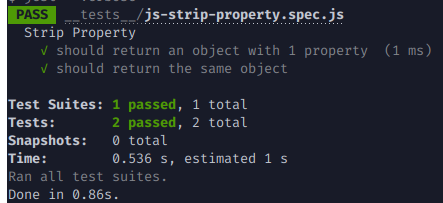

# Desafio

### Aquecimento

Clone utilizando [GIT](https://git-scm.com/) o projeto do do **github**

```bash
git clone 
```

Acesse o diretorio criado

```bash
cd challenge-interview
```

Instale as dependências usando yarn [Instruções de instalação](https://classic.yarnpkg.com/en/docs/install#debian-stable), caso não tenha instalado na sua máquina

```
yarn
```


#### ***FizzBuzz***: 

Implemente a função `generateFizzBuzz` do arquivo `fizzbuzz.js` para que funcione como descrito abaixo, seguindo as regras explicadas.

Dado um número *n*, deve retornar uma lista de 1 até n preenchida com:

- um número
- Fizz
- Buzz
- FizzBuzz

***Regras***: 

- se o número é múltiplo de 3 deve retornar `Fizz` no lugar do número, 
- se o número é multiplo de 5 deve retornar `Buzz`, 
- se o número é múltiplo de 3 e de 5 deve retornar `FizzBuzz`
- se o número não é múltiplo nem de 3 e nem de 5 deve retornar o próprio número.

***Exemplo:***

```bash
n: 15
saida: [1,2,'Fizz',4,'Buzz','Fizz',7,8,'Fizz','Buzz',11,'Fizz',13,14,'FizzBuzz']
```

***Testes:***

Execute os testes unitários para este exercicio com o comando abaixo

```bash
yarn jest
```

O resultado deve ser como a imagem abaixo


#### Strip Property: 

Os objetos literais de Javascript possuem propriedades, estas propriedades podem ser modificadas ou eliminadas. Neste exercicio, deve completar a função `stripProperty` do arquivo `js-strip-property.spec.js`. 

Esta função recebe como parâmetros um objeto javascript `obj` e uma propriedade `prop`. A função deve retornar um novo objeto com as mesmas propriedades e seus valores, excluindo a propriedade cujo denominada `prop`, se existir.

***Exemplo:***

```json
obj: {
    foo: 3,
    bar: 4,
    zzz: 5,
}
prop: 'baz'
saida: {
    foo: 3,
    bar: 4,
    zzz: 5,
}
```

O objeto de saida é igual ao de entrada, porque a propriedade `baz`não existe no objeto.

***Testes:***

Execute os testes unitários para este exercicio com o comando abaixo

```bash
yarn jest
```

O resultado deve ser como a imagem abaixo




